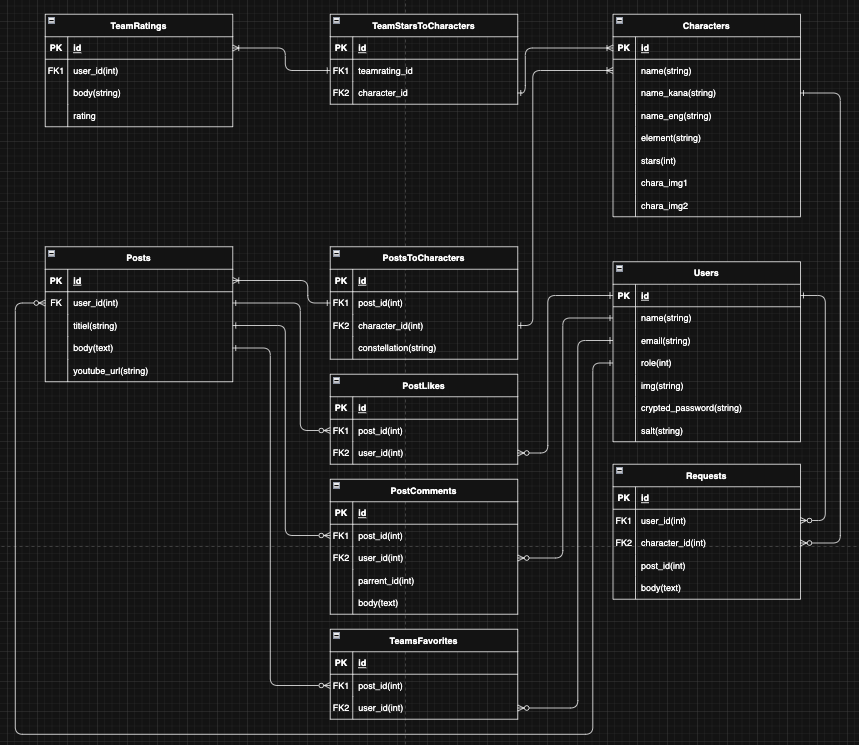

### ER図
（ER図のスクリーンショットの画像）

GyazoURL: https://gyazo.com/c748c702590ed0c13047786f1c3d5a71

### 本サービスの概要（700文字以内）
●概要
原神の編成紹介動画を検索・評価・おすすめ動画の共有が行えるサイト。任意の原神キャラクター1~4人を選択することで該当キャラクターの編成紹介動画（Youtube埋め込み）、編成情報を参照できる。ログインすることでおすすめ編成紹介動画を共有したり、紹介されている編成を評価したり、お気に入り編成登録することができる。

●詳細
◆検索について
・おすすめ動画検索
原神のキャラクターを1〜4対選択し検索することで、該当キャラクターの含まれるおすすめ動画一覧が出現する
キャラクター4体を選んで検索した場合は、該当編成のおすすめ動画に合わせて、該当編成の総合評価および評価に関するコメントが追加で表示される。
もし検索した編成の動画が投稿されていなければ「リクエストボタン」が表示され動画のリクエストをすることができる

・編成評価検索（MVP後）
原神のキャラクターを1〜4対選択し検索することで、該当キャラクターの編成評価一覧が評価の高い順から出現する

◆投稿について
・おすすめ動画のシェア
ログイン者限定で、任意の4対キャラを選択し「おすすめ動画」のYoutube埋込みを投稿することができる
その際に動画のおすすめポイントと各キャラに対して、動画で紹介されている武器や聖遺物（装備）などのビルド情報も登録することができる（必須ではない）

・編成評価
ログイン者限定で、任意の4対キャラを選択し「編成に関する評価(5段階)・コメント」を投稿することができる

◆その他
ログイン者限定で、気に入ったおすすめ動画をお気に入りリストに登録することができる

### MVPで実装する予定の機能
- [x] ユーザー登録機能
- [x] ログイン機能
- [x] パスワード変更機能
- [x] メールアドレス変更機能
- [x] おすすめ動画一覧閲覧機能(未ログインでも可能)
- [x] おすすめ動画検索機能(4体選択検索で編成評価も閲覧可)(未ログインでも可能)
- [x] おすすめ動画投稿詳細閲覧機能(未ログインでも可能)
- [x] おすすめ動画投稿機能 (埋め込みURL,簡易解説)
- [x] 編成評価・コメント投稿機能 (5段階評価)
- [x] コおすすめ編成紹介動画への評価・コメント機能 (いいねボタン)
- [x] 編成紹介動画のお気に入り機能
- [x] 編成投稿リクエスト機能
- [x] リクエストの投稿通知機能(メール通知を想定)

- [x] 管理者機能(管理者のみ可能)(キャラのマスター追加機能)

### ER図の注意点
- [x] プルリクエストに最新のER図のスクリーンショットを画像が表示される形で掲載できているか？
- [x] テーブル名は複数形になっているか？
- [x] カラムの型は記載されているか？
- [x] 外部キーは適切に設けられているか？
- [x] リレーションは適切に描かれているか？多対多の関係は存在しないか？
- [x] STIは使用しないER図になっているか？
- [x] Postsテーブルにpost_nameのように"テーブル名+カラム名"を付けていないか？
